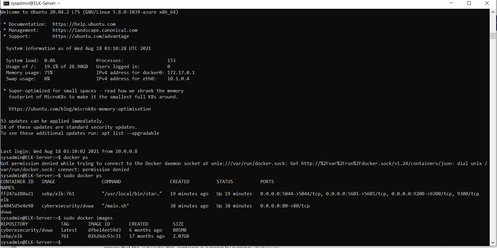

## Automated ELK Stack Deployment

The files in this repository were used to configure the network depicted below.

These files have been tested and used to generate a live ELK deployment on Azure. They can be used to either recreate the entire deployment pictured above. Alternatively, select portions of the Ansible playbook files may be used to install only certain pieces of it, such as Filebeat.

  - dvwa_playbook.yml
  - elk_playbook.yml
  - filebeat_playbook.yml

This document contains the following details:
- Description of the Topology
- Access Policies
- ELK Configuration
  - Beats in Use
  - Machines Being Monitored
- How to Use the Ansible Build

### Description of the Topology

The main purpose of this network is to expose a load-balanced and monitored instance of DVWA, the D*mn Vulnerable Web Application.

Load balancing ensures that the application will be highly available, in addition to restricting public access to the network. 

The loadbalancer protects against DDOS attackes and emerging threats on the internet.

The jumpbox provides a secure point of access to the network for administrators. Via the Jumpbox, internal servers on the private network can be securely accessed.

Integrating an ELK server allows users to easily monitor the vulnerable VMs for changes to the logs and system metrics. Filebeat is used to monitor the system logs while Metricbeat is used to monitor the system resources.

The configuration details of each machine may be found below.

| Name                       | Function            | Ip Address    | Operating System    |
|----------------------------|---------------------|---------------|---------------------|
| Jump_Box_Provisioner-final | Gateway             | 10.0.0.8      | Ubuntu              |
| Web_1                      | Application Server  | 10.0.0.5      | Ubuntu              |
| Web_2                      | Application Server  | 10.0.0.6      | Ubuntu              |
| ElkServer                  | Elasticsearch       | 10.1.0.4      | Ubuntu              |
| Zonal_Load_Balancer        | Load Balancing      | 40.76.111.104 | Azure Load Balancer | 

### Access Policies

The machines on the internal network are not exposed to the public Internet. 

The Load Balancer machine can accept connections from the Internet on Port 80. Access to this machine is only allowed from the following IP addresses:
67.86.164.21

The jump box is accessible via SSH on port 22 only to the IP address: 67.86.164.21

Machines within the network can only be accessed by the jump box.
This jump box has the private IP address of 10.0.0.8 and is able to SSH into the ELK Server.

A summary of the access policies in place can be found in the table below.

| Name              | Publicly Accessible | Allowed IP Addresses   |
|-------------------|---------------------|------------------------|
| Jump Box          | No                  | 67.86.164.21 port 22   |
| Web 1             | Yes                 | 67.86.164.21 port 80   |
| Web 2             | Yes                 | 67.86.164.21 port 80   |
| Load Balancer     | Yes                 | 0.0.0.0/0 port 80      |
| ELK Server        | No                  | 10.0.0.0/24            |
| ELK Server Kibana | Yes                 | 67.86.164.21 port 5601 |

### Elk Configuration

Ansible was used to automate configuration of the ELK machine. No configuration was performed manually, which is advantageous because not only does it help make changes more easily, but new machines with similar configurations can be spun up instantly on-demand.

The playbook implements the following tasks:
- upgrade vm.max_map_count to 262144
- install docker
- install pip3
- install docker python
- download and configure elasticsearch docker image
- enable docker services

The following screenshot displays the result of running `docker ps` after successfully configuring the ELK instance.

### Target Machines & Beats
- Web 1, 10.0.0.5
- Web 2, 10.0.0.6

We have installed the following Beats on these machines:
- Filebeat
- Metricbeat

These Beats allow us to collect the following information from each machine:
- Filebeat collects data on the logs that are stored on the webservers.
- Metricbeat collects data on the webservers themselves regarding resource consumption.

### Using the Playbook
In order to use the playbook, you will need to have an Ansible control node already configured. Assuming you have such a control node provisioned: 

SSH into the control node and follow the steps below:
- Copy the dvwa_playbook.yml file to /etc/ansible/dvwa_playbook.yml.
- Copy the elk_playbook.yml file to /etc/ansible/elk_playbook.yml
- Copy the filebeat_playbook.yml file to /etc/ansible/filebeat_playbook.yml
- Copy the filebeat-config.yml to /etc/ansible/filebeat-config.yml
- Make sure the “hosts” parameter of both the filebeat_playbook and dvwa_playbook says “webservers”. 
- Make sure the “hosts” parameter of the elk_playbook says “elk”.
- Update the Ansible Hosts file to include the IP addresses of the webservers.
- Update the Metricbeat-config and Filebeat-config with the IP address of the ELK Server.
- Run the DVWA playbook, then the ELK Playbook, then the Filebeat playbook in that order. Navigate to the ELK Server’s public IP on port 5601 to check that the installation worked as expected. You should see Kibana running.

